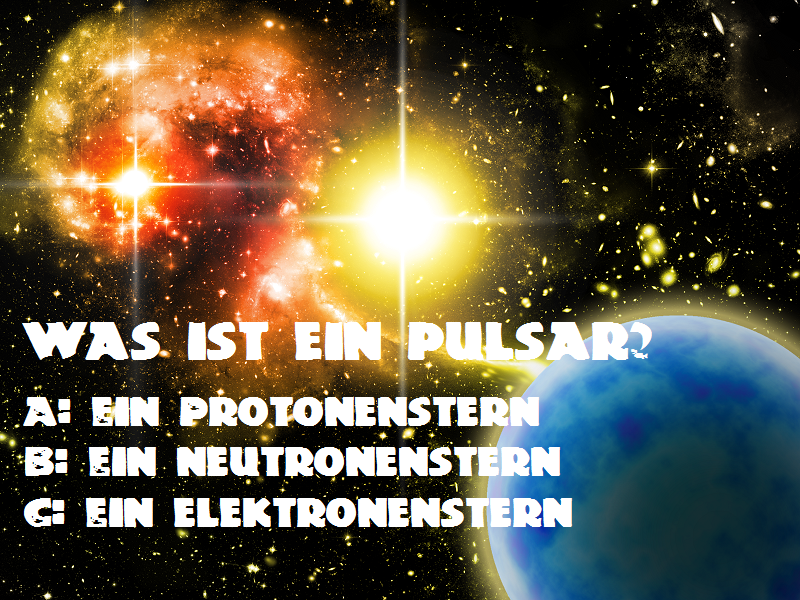
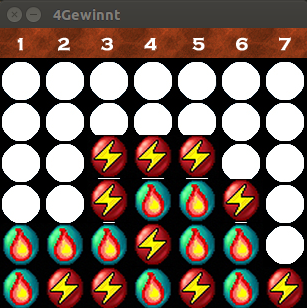

# Spiele in C++

## Im Sommersemester 2017

### Weltraumquiz

**von Luca Pauline Paeschke**

[Code und Beschreibung zum Spiel](projekte_ss2017/weltraumquiz/README.md)

----

## Im Wintersemester 2016/2017

### Kisten Schieben

**von Ariane Wilke**

[Code und Beschreibung zum Spiel](projekte_ws2016/kisten_schieben/README.md)

----

### Vier Gewinnt

**von Natalia Neumeister und Nikola Nikolov**

[Code und Beschreibung zum Spiel](projekte_ws2016/vier_gewinnt/README.md)

## Lizenzbedingungen

Sofern nicht anders angegeben, unterliegen alle hier veröffentlichten Programme den Bedingungen der **MIT License**. 

## Kursleitung und Kontakt

Dr. Kristian Rother

[krother@academis.eu](mailto:krother@academis.eu)
