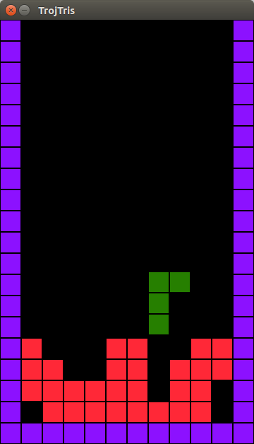
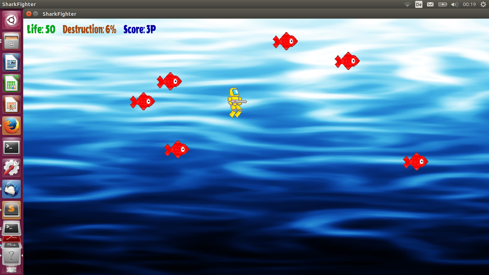
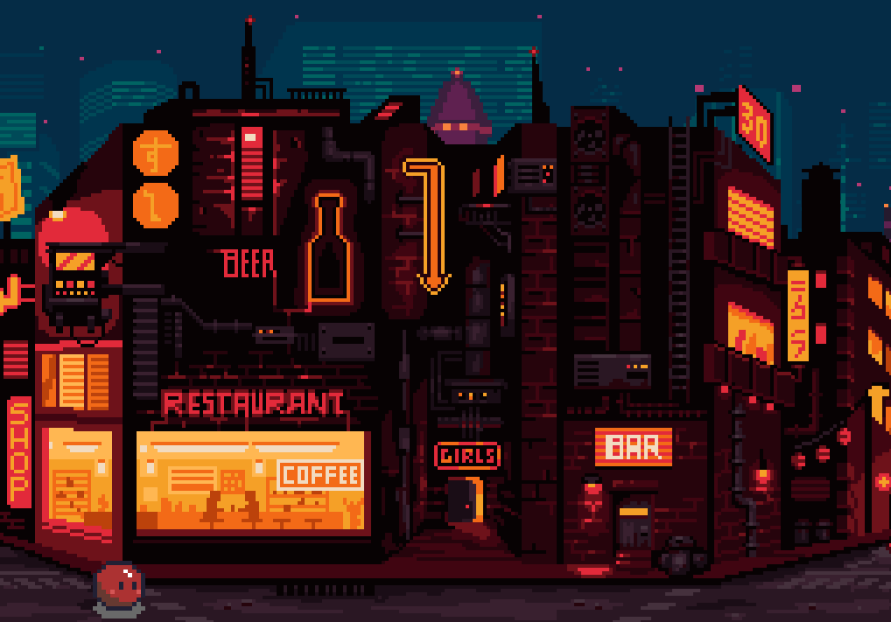
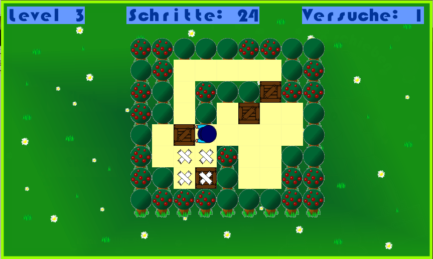

# Spiele in C++

## Im Sommersemester 2017

### Weltraumquiz

**von Luca Pauline Paeschke**

[Code und Beschreibung zum Spiel](projekte_ss2017/weltraumquiz/)

----

### Trojtris

**von Andreas Trojand**

[Code und Beschreibung zum Spiel](projekte_ss2017/trojtris/)

----

### Sharkfighter

**von Sebastian Kulich**

[Code und Beschreibung zum Spiel](projekte_ss2017/sharkfighter/)

----

### Streetrunner

**von **von Arturo Jose Maximiliano Bertoglia Fuentes**

[Code und Beschreibung zum Spiel](projekte_ss2017/streetrunner/)

----

## Im Wintersemester 2016/2017

### Kisten Schieben

**von Ariane Wilke**

[Code und Beschreibung zum Spiel](projekte_ws2016/kisten_schieben/)

----

### Vier Gewinnt

**von Natalia Neumeister und Nikola Nikolov**

[Code und Beschreibung zum Spiel](projekte_ws2016/vier_gewinnt/)

## Lizenzbedingungen

Sofern nicht anders angegeben, unterliegen alle hier veröffentlichten Programme den Bedingungen der **MIT License**. 

## Kursleitung und Kontakt

Dr. Kristian Rother

[krother@academis.eu](mailto:krother@academis.eu)
